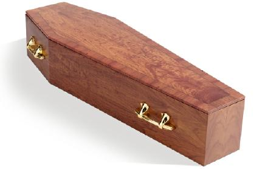
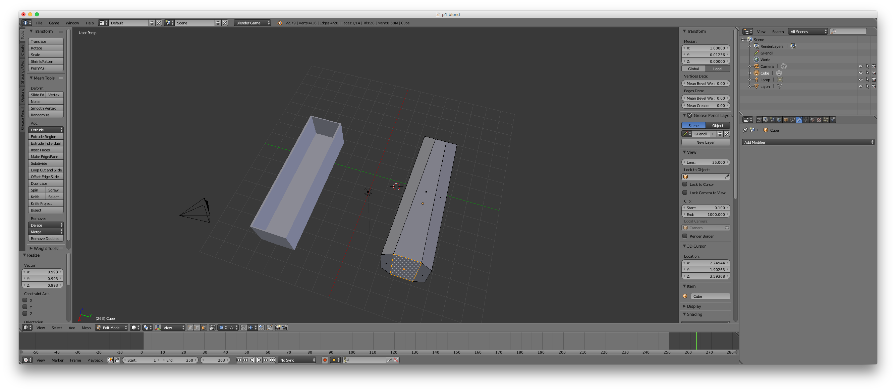

# Práctica 1: Modelado con Blender

> Ernesto Serrano Collado

## Objetivo

El objetivo de esta práctica es realizar un modelo con Blender.

He elegido realizar un ataud (coffin) ya que se puede formar con transformaciones geométricas sencillas que nos ayudarán a conocer el funcionamiento del programa

## Proceso de diseño

Para diseñarlo se ha partido de un cubo que se ha estirado para darle forma rectangular, mas tarde se le ha restado la parte interna con operaciones booleanas.

Despues se ha agregado una partición con `Ctrl+R` para haer el pico superior. Una vez particionado se han seleccionado ambas aristas con `Ctrl+Click` y pulsando `S` se le ha cambiado le tamaño.

Para la tapa se ha duplicado el objeto y se ha reducido su altura permitiendo así darle un aspecto de moldura.

## Resultado

El modelo final es una versión bastante simplificada de la real:

## Capturas del proceso de diseño

Se adjuntan una serie de capturas del proceso de diseñado

