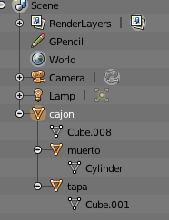
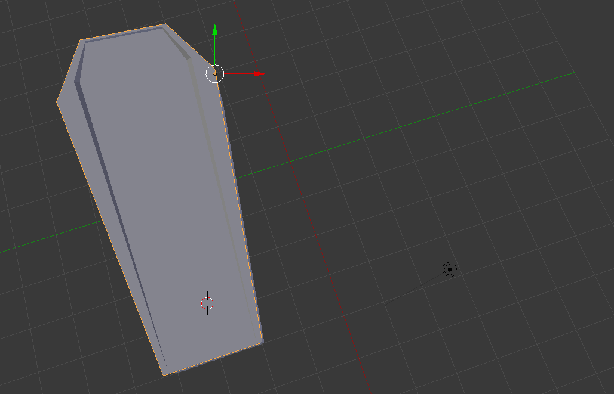
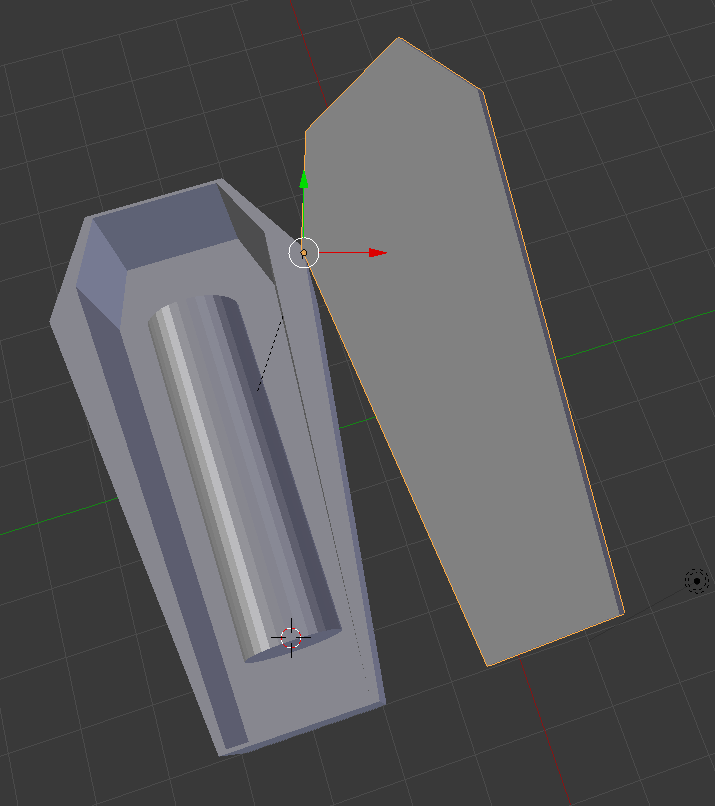
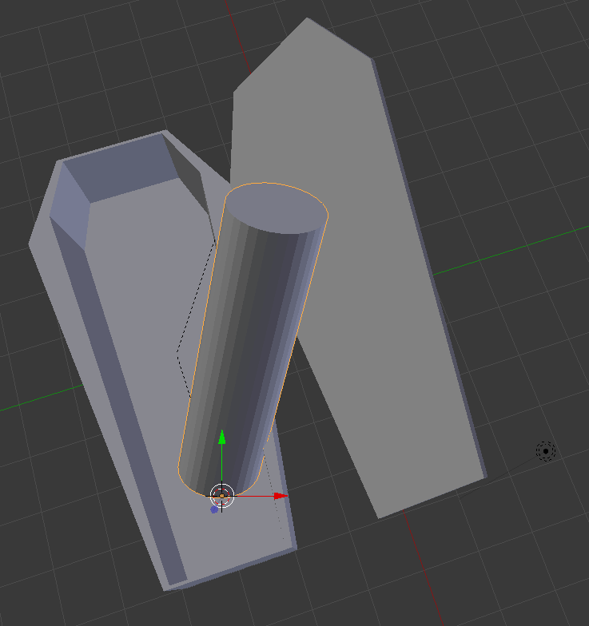
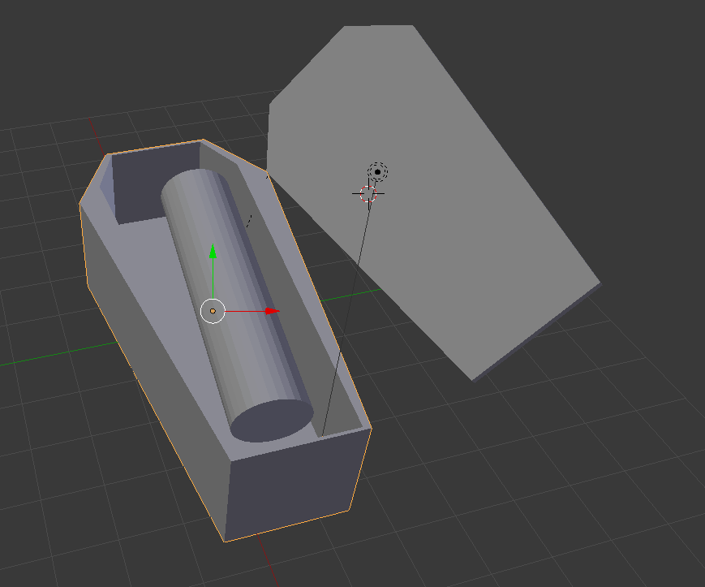

# Práctica 2: Creación de modelos

> Ernesto Serrano Collado

## Objetivo

El objetivo de esta práctica es aprender a crear grafos de escena en Blender

## Proceso de diseño

### Modelo

Sobre la base del ataúd de la práctica anterior vamos a realizar un sencillo grafo de escena agregando movimiento a la tapa y incluyendo contenido en el ataúd.

### Jerarquía

Una vez abierto el modelo se ha establecido la jerarquía padre-hijo que se muestra en la imagen adjunta:

Para diseñarlo se ha partido del diseño de la practica anterior definiendo el origen a donde hemos clickado el cursor con la opción `Transform -> Origin to 3D cursor`.

Tambien hemos bloqueado las transformaciones de rotación excepto la que que querremos permitir.

## Capturas del proceso de diseño

Se adjuntan una serie de capturas del proceso de diseñado

El resultado final es el siguiente:

