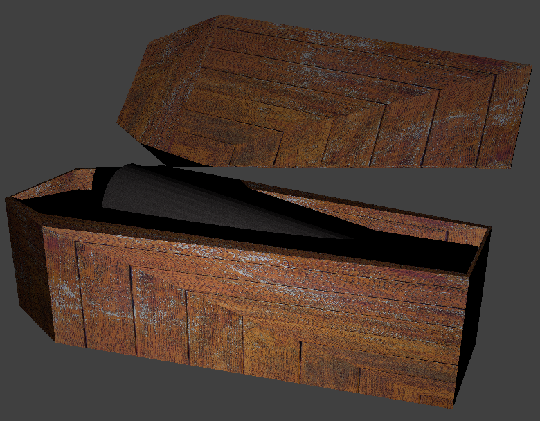

# Práctica 3: Texturas

> Ernesto Serrano Collado

## Objetivo

El objetivo de esta práctica es aplicar una textura a nuestro modelo

## Proceso de diseño

### Modelo

Sobre la base del ataúd de la práctica anterior vamos a aplicarle texturas

Las texturas las hemos extraido de la pagina http://www.wildtextures.com/free-textures/

## Resultado final

