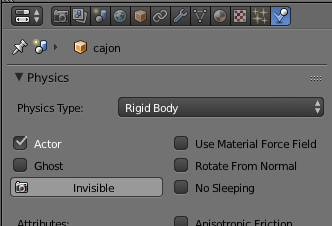
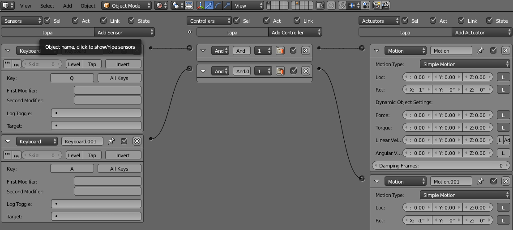
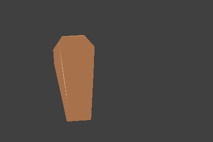
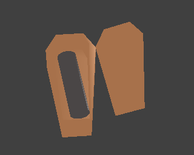
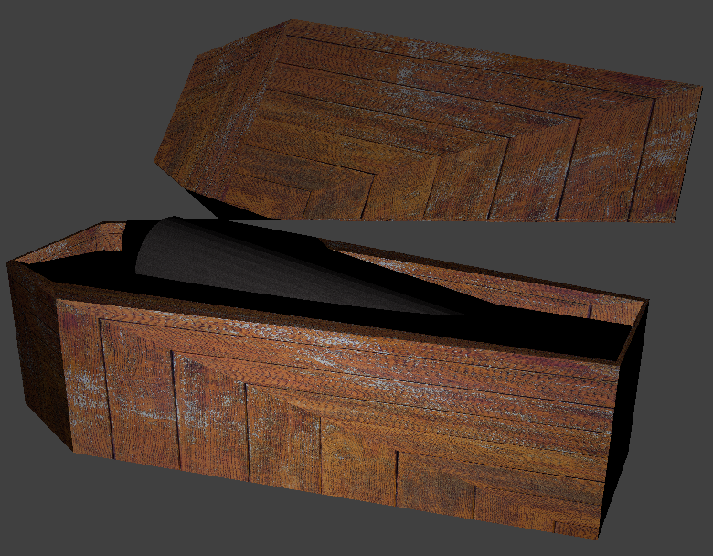

# Práctica 4: Interacción

> Ernesto Serrano Collado

## Objetivo

El objetivo de esta práctica es aprender a construir entornos interactivos con Blender.

Vamos a agregarle interacción con el teclado para que dependiendo de una tecla se abra o cierre la tapa del ataúd.

## Proceso de diseño

### Tareas previas

En primer lugar cambié las propiedades del mundo (gravedad 0) y del objeto (rigid body):

Mas tarde agregé la lógica de las teclas cambiando el motion

### Movimiento del ataúd

En nuestro caso realizamos la interacción de abrir y cerrar la tapa del ataud con las teclas Q y A.

- **Tecla Q:** Abrir tapa (Rotar eje X+)
- **Tecla A:** Cerrar tapa (Ratar eje X-)

## Capturas del proceso de interacción

Se adjuntan una serie de capturas del proceso, en el Mac el modo game da algunos problemas de pintado, por eso se ve de esta forma

## Resultado final

