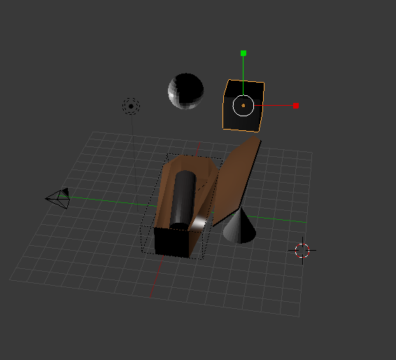
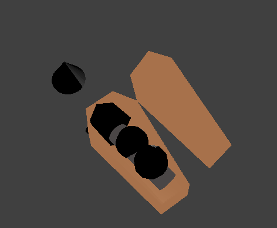
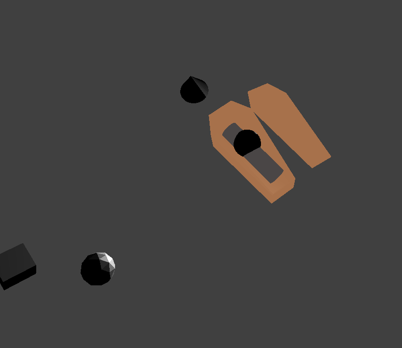
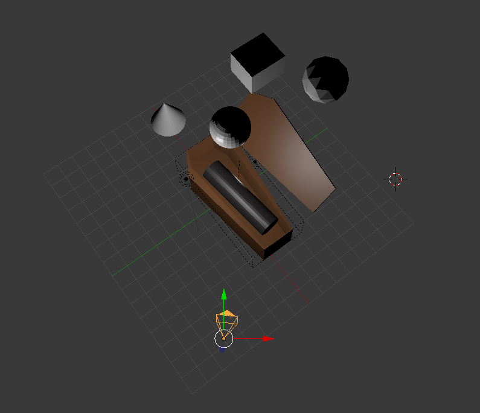
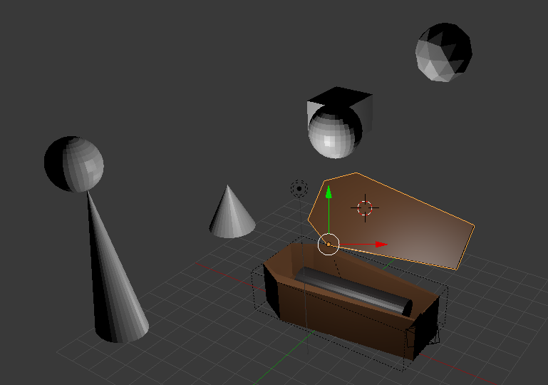

# Práctica 5: Simulación

> Ernesto Serrano Collado

## Objetivo

El objetivo de esta práctica es aprender a utilizar el motor de física de Blender.

## Proceso de diseño

Se han configurado las propiedades fisicas del mundo y de nuestro avatar (ataúd).

Se han agregado figuras geometricas con distintos valores, una esfera, un cono y un cubo.

Se han colocado de forma que al poner en marcha la simulación chocan con nuestro avatar. Asimismo, si en dicho proceso movemos la tapa del ataud (Teclas `A` y `Q`) podemos modificar la trayectoria las figuras y/o dejar que choque de forma diferente.

Para probar las restricciones se ha agreagdo un cono y una esfera y se han unido con una restricción de tipo bisagra (hinge), al darle a la animación podemos ver como la bola empieza a moverse pero se ve unida a la punta del cono.

## Capturas del proceso de simulación

## Resultado final

