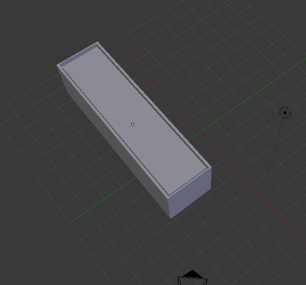
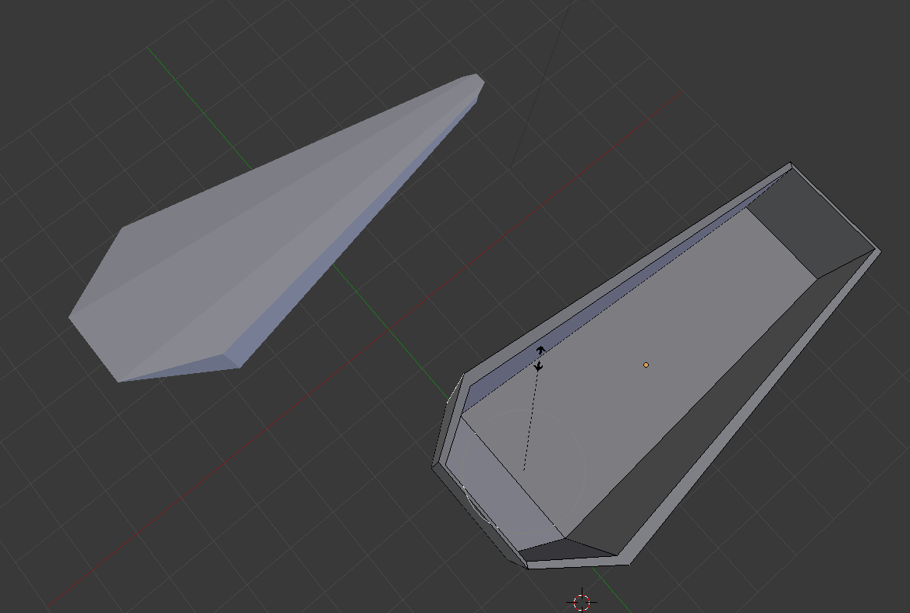
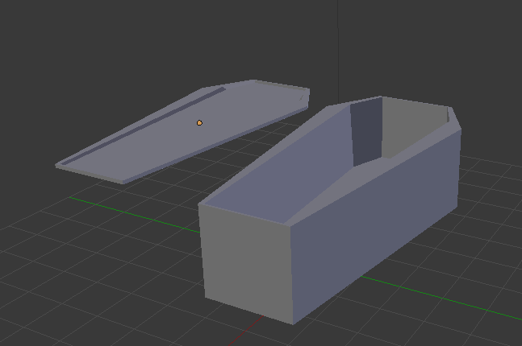
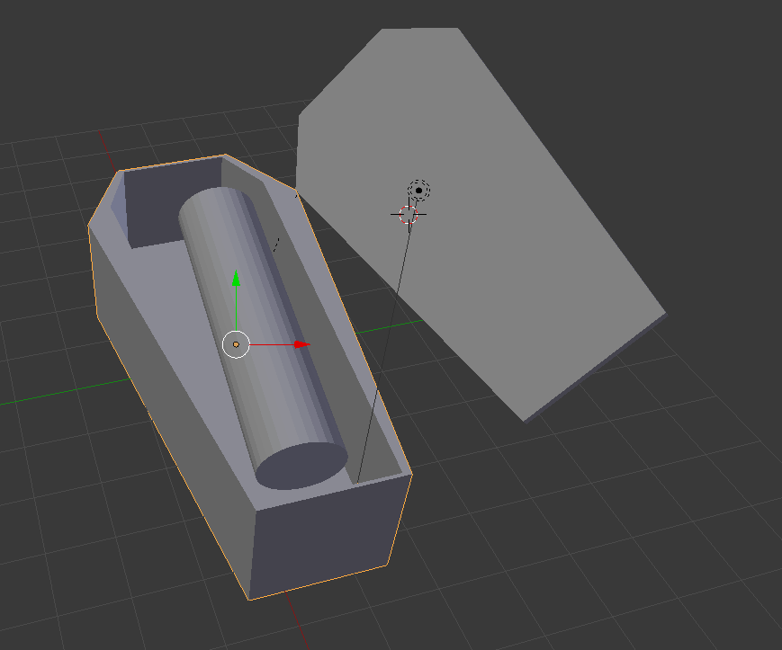
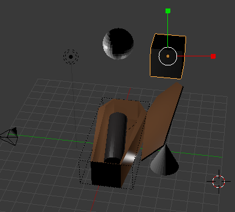
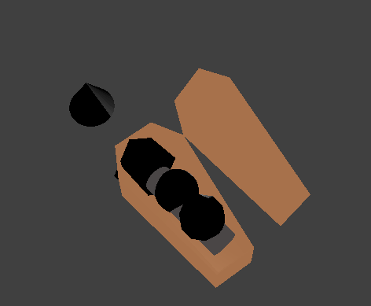
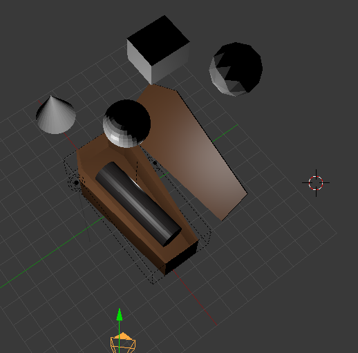

# Práctica 6: Proyecto

> Ernesto Serrano Collado

## Objetivo

El objetivo de esta práctica es crear un entorno virtual integrando los trabajos realizados en las prácticas anteriores.

## Proceso de diseño

Como ya se ha ido integrando todo conforme se iban avanzando las prácticas lo unico necesario ha sido mantener la interacción de la práctica con las teclas `A` y `Q` con el modelo que se creó originalmente.

## Capturas del proceso de simulación

